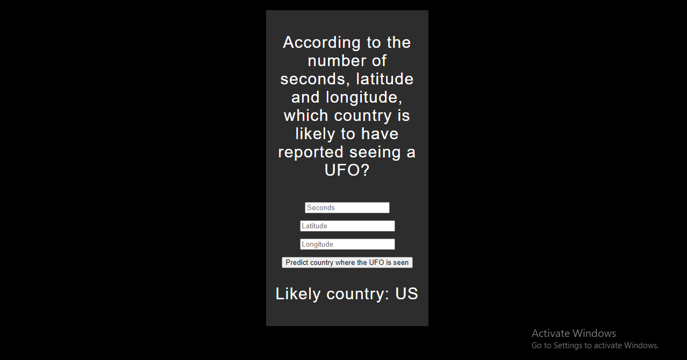

# UFO sighting application Using Machine Learning Model

you will train an ML model on a data set that's out of this world: UFO sightings over the past century, sourced from NUFORC's database.

# Building an app

The tools we will be using to build this app is flask, Pickle

✅ What's Flask? Defined as a 'micro-framework' by its creators, Flask provides the basic features of web frameworks using Python and a templating engine to build web pages. Take a look at this Learn module to practice building with Flask.

✅ What's Pickle? Pickle 🥒 is a Python module that serializes and de-serializes a Python object structure. When you 'pickle' a model, you serialize or flatten its structure for use on the web. Be careful: pickle is not intrinsically secure, so be careful if prompted to 'un-pickle' a file. A pickled file has the suffix .pkl.

### first step: clean your data

### Second step: build your model

### Third Step: 'pickle' your model

### Last Step: Build a Flask app

Result:

